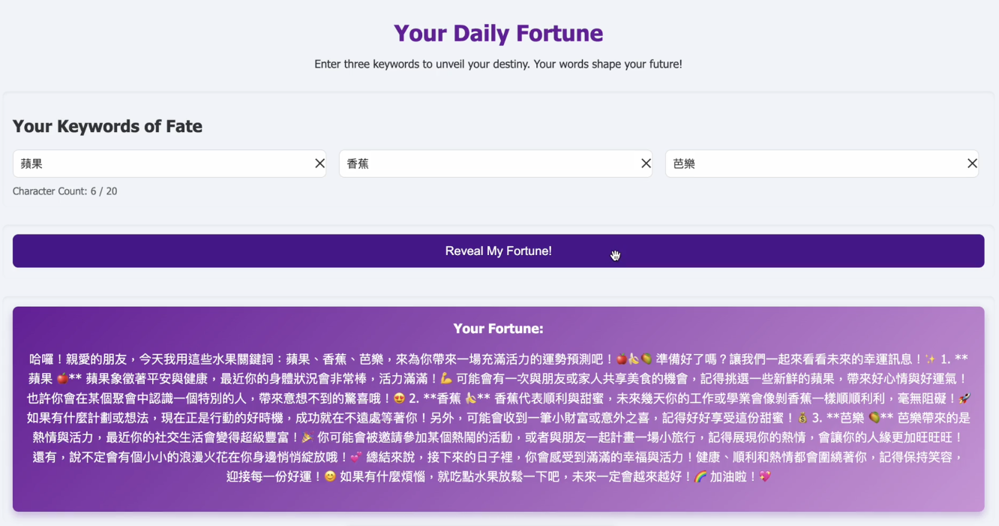

fortune-grok



🛠 專案簡介

fortune-grok 是一個運勢查詢網站，讓使用者登入 Google 帳號後輸入三個中英文關鍵字（最多 20 字）查詢當日運勢（帶有表情符號的活潑風格）。

🔗 架構概覽

使用者 → Nginx (反向代理)
├── / (Nuxt 3 SSR 前端)
└── /api (FastAPI 後端)
↓
MariaDB
↓
Grok API

⚙️ 技術棧

- Vue (Nuxt 3) + JavaScript（SSR）
- FastAPI + MariaDB
- OAuth：Google
- AI：Grok API
- CI/CD：GitHub Actions + Docker Hub

🚀 本地開發指引

1. 環境準備

```bash
# 複製環境變數範本
cp .env.example .env

# 編輯 .env 填入必要的設定
vim .env
```

2. 啟動服務

```bash
# 構建並啟動所有服務
docker compose up --build

# 或在背景執行
docker compose up -d
```

3. 服務位置

- 前端：http://localhost:3000
- 後端：http://localhost:8000
- API 文件：http://localhost:8000/docs

4. 常用指令

```bash
# 查看服務狀態
docker compose ps

# 查看日誌
docker compose logs -f

# 重啟特定服務
docker compose restart [service_name]

# 停止所有服務
docker compose down

# 清除資料庫資料
docker compose down -v
```

5. 開發模式

- 前端程式碼在 ./frontend
- 後端程式碼在 ./backend
- 修改程式碼後會自動重新載入

⚠️ 注意事項

1. 請確保已安裝 Docker 和 Docker Compose
2. 首次啟動時需要等待資料庫初始化完成
3. 開發時請勿提交 .env 檔案
4. Google OAuth 需要有效的憑證才能測試登入功能

🔧 常見問題排解

1. 資料庫連線失敗

```bash
# 確認資料庫容器狀態
docker compose ps
# 查看資料庫日誌
docker compose logs db
```

2. 服務無法啟動

```bash
# 檢查 port 是否被占用
lsof -i :3000
lsof -i :8000
```

3. 程式碼變更沒有生效

```bash
# 重建服務
docker compose up --build
```
